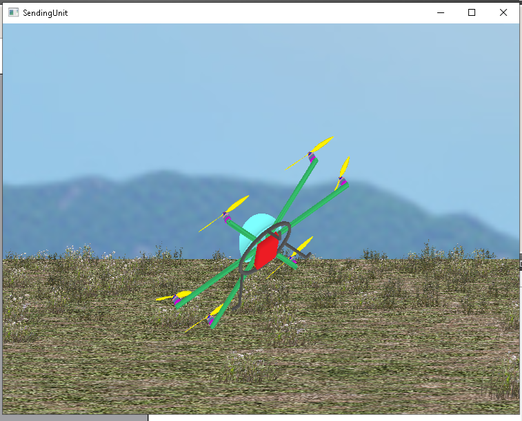

# VectorFlight
### Flight Control Stack & Physics Simulation

 I spent years researching network behavior such as packet loss, misordered, packets, latency etc. I made a responsive, light and yet robost communication protcol designed for remote applicaitons.

I made a physics simulation and a flight control algorithm that runs inside it. I discovered years later that NASA calls this "Software in the loop". You can use this as a plotless video game in loopback mode.  You could use it to control distant drones or merely draw inspiration from it to write other software.

The coummunication protocol used "ZPack" has lower overhead and higher efficiency than MAVLink. 

| Simulation | User Input | SuperVars |
| :---: | :---: | :---: |
|  |  |  |

## 📖 Documentation

[**Chapter 1 - Quick Start Localhost/Loopback - Simulation** ](docs/Chapter1_Loopback_QuickStart.md)   
This is a quick start guid that explains the most simple use case on the most simple hardware.

[**Chapter 2 - SuperVars** ](docs/SuperVars.md)   
This chapter explains the supervar definitions.  

[**Chapter Y - AI Generated Comprensive Documentation** ](docs/ChapterZ_AI_Generated_Docs.md)  
This is an **--extensive--** though, largely **--unverified--** AI-generated documentation.  
Its contents will be verified than migrated into chapters above.

[**Chapter Z - Screenshots** ](docs/Screenshots.md)  
These screenshots will be incorporated into the documentation above.

 

# Typical Remote Control Architecture
The remote aircraft could be:
1.  A simulation on the same computer.
2.  A simulation ran on a different (or remote) computer
3.  A physical aircraft.

---

## 📂 Interesting Sourcecode  Files to Explore

* **Flight Control Algorithm:** [`z01_SimFlightControl.h`](https://github.com/ZackTronics/VectorFlight/blob/main/VectorFlight_Pegasus_Core/OpenGL/z01_SimFlightControl.h)
* **Simulation Engine:** [`GL_4_Animate.h`](https://github.com/ZackTronics/VectorFlight/blob/main/VectorFlight_Pegasus_Core/OpenGL/GL_4_Animate.h)
* **Memory Framework:** [`superVar_Declarations.h`](https://github.com/ZackTronics/VectorFlight/blob/main/VectorFlight_Pegasus_Core/Globals/superVar_Declarations.h)
* **Communication Protocols:** [Communications Directory](https://github.com/ZackTronics/VectorFlight/tree/main/VectorFlight_Pegasus_Core/Communications)

 

---

## ⚖️ License
Original control logic, physics engine, and protocol definitions are licensed under the **MIT License**.
Copyright (c) 2026 Zacktronics.

This project utilizes the **Qt Framework**, used under the **GNU LGPL v3**.

 

---

## 👨‍💻 About the Author

[https://zacktronics.com/](https://zacktronics.com/)