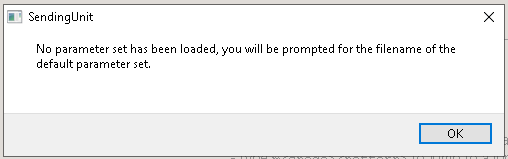

## Chapter 0: Quick Start (Loopback Demo) 
For the most straightforward introduction to the system, you can run a "Loopback" simulation where the Ground Control interface and the 3D OpenGL renderer run on the same machine. 

# 1 Install the Prerequisites
## Windows

1. Install <a href="https://download.qt.io/new_archive/qt/5.5/5.5.1/">**qt-opensource-windows-x86-msvc2010-5.5.1.exe**</a>
2. Download	 <a href="https://www.microsoft.com/en-us/download/details.aspx?id=8109">**directx_Jun2010_redist.exe**</a> <br>
      Run it then choose an output folder, <br>
    From the extracted folder, run **DXSETUP.exe**
2. Install <a href="**https://download.qt.io/new_archive/qt/5.5/5.5.1/**">**MSVC++2010.**</a>
4.  Click Start "Add an optional feature" <br>
Install Graphics Tools.<br>
<br>
Click "Add
5.  **Virtual Machine Users:** > If the simulation window appears black, ensure that 3D Acceleration is enabled in your VM settings and that Guest Additions are installed. Without hardware acceleration, the DirectX 11 shaders may fail to render.   
.  

## Linux

The program is also Linux compatible.<br>
Instead of using MSVC, GCC is used.<br>

If using this software on a PC as a ground control station there is nothing to do.  The code shown below in `z01_mainwindow.cpp` includes XBox controller drivers for both Linux and Windows and they each have include guards for their OS.
<br>


```
#ifdef TARGET_HARDWARE_PI
//#include "systemDependent/joystickPoll_HelicopterMode.h"
#endif
#ifndef TARGET_HARDWARE_PI
#include "systemDependent/joystickPoll_Dummy.h"
#include "systemDependent/joystickPoll_Linux.h"
#include "systemDependent/joystickPoll_win.h"
#endif
```
Note: <br> If you wanted to run the software in an embedded target you would need to define:
`TARGET_HARDWARE_PI`.
This would disable the physics engine, OpenGL, and would enable sharing of SuperVars (Via I2C) with a flightboard (microcontroller with sensors and motor controllers.).

<br><br>

---


# 2 Start the Flight Simulation in Loopback Mode.

Regardless of what OS the software was installed to, as along as OpenGL is available, you can use the simulated helicopter in loopback
1. Pull the repo.
2. Double clikc **SendingUnit.pro** Qt Creator qill open.
3. Click the green "Play" triangle.
4. You will be prompted for parameters<br>
<br>
Click OK then from the `VectorFlight_Pegasus_Core`folder, select `defaultSettings.rtz`
5.  You will then see the following popup.<br>
<br>
Click "**OK**" then close the "Pegasus Control" main window.<br>

6.  Copy this folder:<br>
   `VectorFlight_Pegasus_Core/model`  (just the model subdir") <br>
To the build or debug directory that was created when you clicked the green play button.<br>For instance, you should create this folder:<br>
`build-SendingUnit-Desktop_Qt_5_5_1_MSVC2010_32bit-Debug/model`
7.  Click the green play triangle again. <br>
You will see the following screen. <br> When you connect an XBox controller the following text should dissappear.<br>

8.  CLick "**Main Display**" --> "**Controller Input**"<br>
To test your controller<br>
<br>

9.  CLick "**Main Display**" --> "**Helicopter Simulation**"<br>
10.  Press the "A" key to disable the Autopilot and take control of the aircraft.
11.  Thumbstick up to take off.

