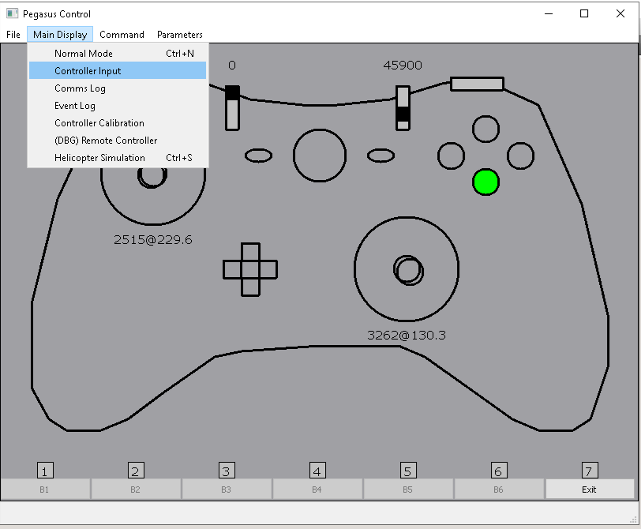
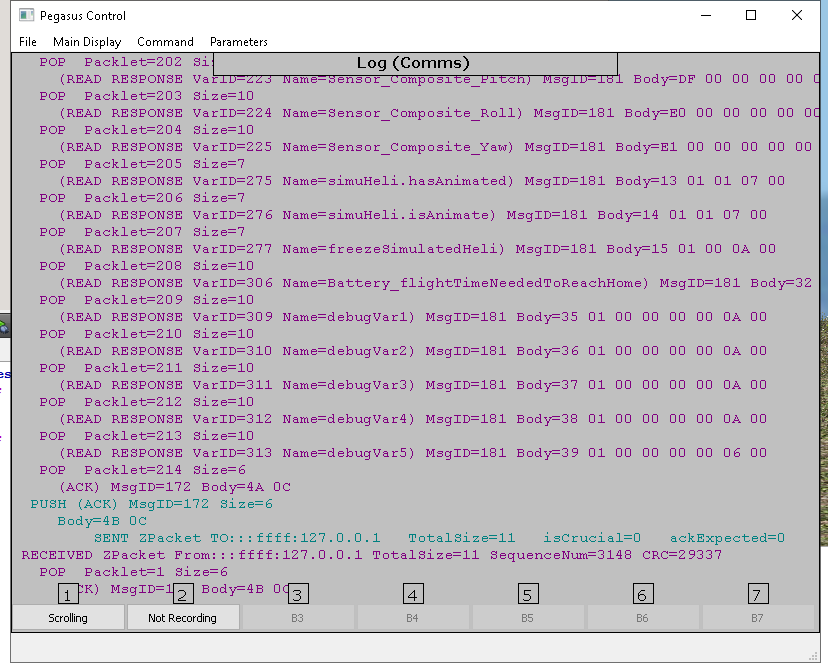
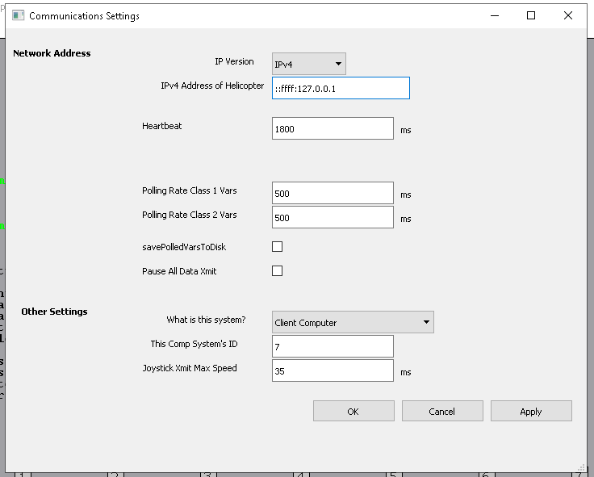
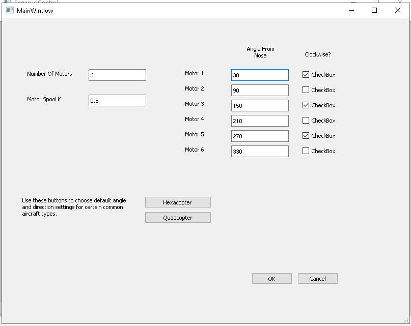
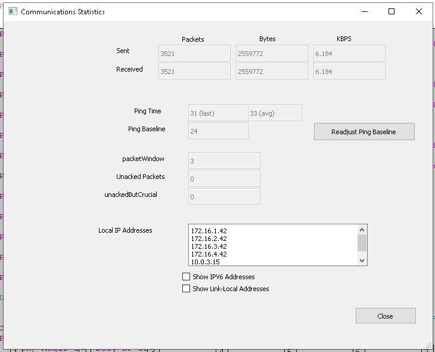

#

These are screen captures from Vectorflight

  

# Main Display ->Controller Input

  

# Main Display ->Comms Log

  

# Parameters-->All parameters
All parameters are instantly searchable  
(Status Parameter Examples)
 
(Configuration Paramter Examples)

  

# Parameters->Communication Log

  

# Parameters->Aircraft Geometry

  

# Parameters->Communication Status
