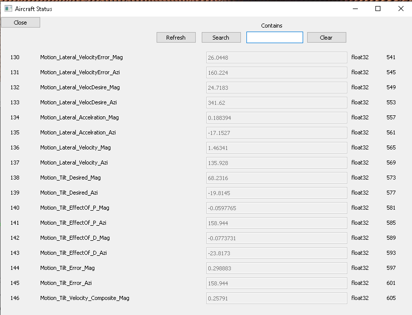
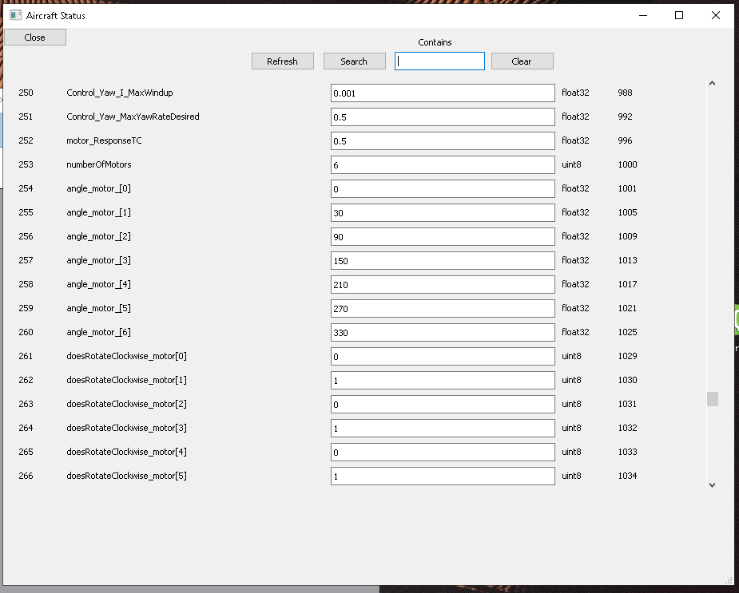
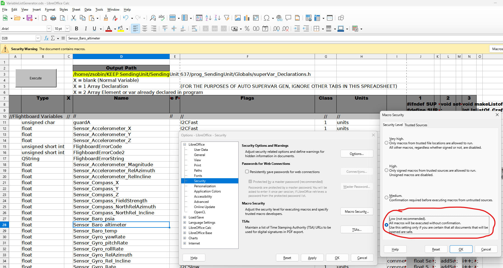

# SuperVars

The GroundControl Station and Embedded Target have the same software.  Its mode (helicopter vs embedded) is selected through a preprocessor definion.<br><br>
The Flightboard Runs a separate piece of software.  It contains the same flight control algoorithm as the simulation that appears in VectorFlight but has code to interface with vectorflight and with the sensors and motor controllers.
  

**SuperVars** can be transmitted the following ways: <br>

1.  Between the Ground Control Station and the Embedded Target. *(Via the ZPack protocol)*
2.  Between the Embedded Target and the FlightBoard.
   


ZPack can transmit Supervars very fast but the variables and their associated flags must be defined at compile time. <br> They contain the following fields.<br>
1. DataType <br>
2. Name <br>
3. Class
4. Units
5. Comments
6. Flags *(I2CSlow, I2CFast, noFlags, plsHandshk, UserEditable, defIsRetain )* <br>

# Ground Control Station "All Settings"

<br><br>

# Ground Control Station Variable List
All parameters are instantly searchable in the following window:<br>
**Parameters --> All parameters**

| Status Parameter Examples | Configuration Parameter Examples |
| :--- | :--- |
| <br><br><br>|  <br>|

<br><br>

# Supervar Flags

These Flags define the communication between the ground control station and the embedded target (Via the ZPack protocol.) <br> They also define commmunication between an Embedded Target and the  flightboard.<br><br>
Each SuperVar can have one or more flags.

<br>


## 1. noFlags
Every SuperVar requires at least one flag.  This is the "catch all"

<br>

## 2. plsHandshk
Important settings that require a 100% verification of state between the ground control station and the embedded target before flight can begin.  

**Note:**
During the handshake if any of these variables have a conflicting value between the embedded target and the ground control station the user will be informed. The user will then be able to choose which value to use.

This could be useful when making "offline changes", or if using a differnet ground control station to control the same drone.
 
<br>

## 3. UserEditable
This is a "setting" not a "status".<br>
The ground congrol station can write to this variable.<br>
Users can also write to it via the Variable list screen.
 
<br>

## 4. defIsRetain
Changes to these are saved in a non-volatile way.


<br>


## 5. I2CFast / I2CSlow
**Define communication between the embedded target and the flighboard ONLY**<br>
Variables flagged with I2CFast are your mission-critical, high-frequency data points.  Variables flagged with I2CSlow are things that change gradually or aren't critical for immediate flight stabilization—like battery voltage, error strings, or GPS coordinates.


<br><br><br><br>


# VariableListGenerator.ods

They are defined in this spreadsheet but you must disable macro security: <br>
`Tools->Optoins->Security->MacroSecuirty->Low->OK`<br>
The script behind the "Execute" button can be found here:<br>
`Tools->Macro's->Edit Macros->VariableListGenerator.ods->Standard->Module1->CopyCalcCellstoText`



<br><br>


## Section 1 - Definitions
The output of the above spreadsheet is found in 3 columns.  

You will find variable declartions in column "**J**".  Paste them into  `superVar_Declaraions.h`

```
//Flightboard Variables
     unsigned char guardA;
     float Sensor_Accelerometer_X;
     float Sensor_Accelerometer_Y;
     float Sensor_Accelerometer_Z;
     unsigned short int FlighboardErrorCode;
     unsigned short int FlighboardErrorCode2;
     QString FlighboardErrorString;
     float Sensor_Accelerometer_Magnitude;
     float Sensor_Accelerometer_RelAzimuth;
```

<br>
<br>

## Section 2 - Calls to 'addSuperVar '
You will find these in column "**L**"<br>

```
void setVariableData(){
;
//Flightboard Variables
addSuperVar(guardA,     "guardA", I2CFast ,1,"units - comment");
addSuperVar(Sensor_Accelerometer_X,     "Sensor_Accelerometer_X", I2CFast ,1,"units - comment");
addSuperVar(Sensor_Accelerometer_Y,     "Sensor_Accelerometer_Y", I2CFast ,1,"minutes - comment");
addSuperVar(Sensor_Accelerometer_Z,     "Sensor_Accelerometer_Z", I2CFast ,1,"minutes - comment");
addSuperVar(FlighboardErrorCode,     "FlighboardErrorCode", I2CSlow ,1,"minutes - comment");
addSuperVar(FlighboardErrorCode2,     "FlighboardErrorCode2", I2CSlow ,1,"minutes - comment");
addSuperVar(FlighboardErrorString,     "FlighboardErrorString", I2CSlow ,1,"minutes - comment");
addSuperVar(Sensor_Accelerometer_Magnitude,     "Sensor_Accelerometer_Magnitude", I2CSlow ,1,"minutes 
```
Note:  `addSuperVar` is defined in `/Globals/superVar1.h` <br>
It  acts as a registration function that links your standard C++ variables into the custom "SuperVar" memory management system.


<br>
<br>

## Section 3 - Safety Code
You will find these in column "**N**"<br>
```
void makeListofCraftStatus(){
int l=listOf_CraftStatus;int i=-1;QString errText="listOf_Craft overflow";
//Flightboard Variables
i++; detectOverflow(i, maxListIndex, errText) ;varList[l][i] = getVarID("guardA");
i++; detectOverflow(i, maxListIndex, errText) ;varList[l][i] = getVarID("Sensor_Accelerometer_X");
i++; detectOverflow(i, maxListIndex, errText) ;varList[l][i] = getVarID("Sensor_Accelerometer_Y");
i++; detectOverflow(i, maxListIndex, errText) ;varList[l][i] = getVarID("Sensor_Accelerometer_Z");
i++; detectOverflow(i, maxListIndex, errText) ;varList[l][i] = getVarID("FlighboardErrorCode");
i++; detectOverflow(i, maxListIndex, errText) ;varList[l][i] = getVarID("FlighboardErrorCode2");
```


<br><br>


---

# Comm Settings and Defines


## HelicopterMode
This is an enumerated string. <br>
1 = Ground station<br>
0 = Embedded Target


This is some of hte code involved.<br><br>
 `z02_commsettings.cpp`
```
int z02_commSettings::applySettings()
    {
    int settingsWereApplied = 0;
    int msgboxResult;
    if     (HelicopterMode != ui->comboBox_2->currentIndex()){
        QString strSysType("");
        if (HelicopterMode == 0)    strSysType.append("New Mode--->This computer is a helicopter itself.");
        if (HelicopterMode == 1)    strSysType.append("New Mode--->This computer is used by a person to control a helicopter.");
```


 `joystickPoll_HelicopterMode.h`
```
//*******************************************
//Slot:     pollJoystick()
//Purpose:
//
//Zackery Sobin
//*******************************************
void MainWindow::pollJoystick()
{
     HelicopterMode = 1;
}
```


<br><br>


## define TARGET_HARDWARE_PI
Enables I2C Polling betweetween the VectorFlight instance and a flightboard. <br>
This compilation flag will not be used on a ground control station. 

